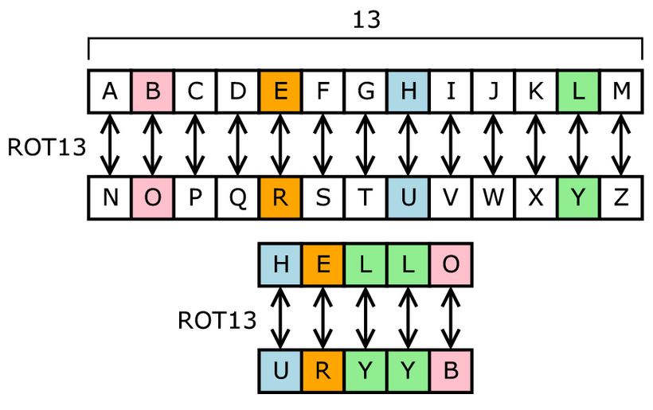

# 13 (Easy)
- [Challenge information](#challenge-information)
- [Solution](#solution)
- [References](#references)

## Challenge information
```
Challenge Link: https://play.picoctf.org/practice/challenge/62?category=2&difficulty=1&page=1
Challenge Description: Cryptography can be easy, do you know what ROT13 is? cvpbPGS{abg_gbb_onq_bs_n_ceboyrz}
```

## Solution
Fairly easy challenge, you can do it manually or use an online tool. Essentially ROT13 substitution cipher meaning each letter is replaced by the letter 13 positions after it in the alphabet.



So decrypting it will land us the plaintext:
```
cvpbPGS{abg_gbb_onq_bs_n_ceboyrz} --> picoCTF{not_too_bad_of_a_problem}
```

## References
- [ROT13 Decipher](https://rot13.com/)
- [ROT13](https://en.wikipedia.org/wiki/ROT13)
