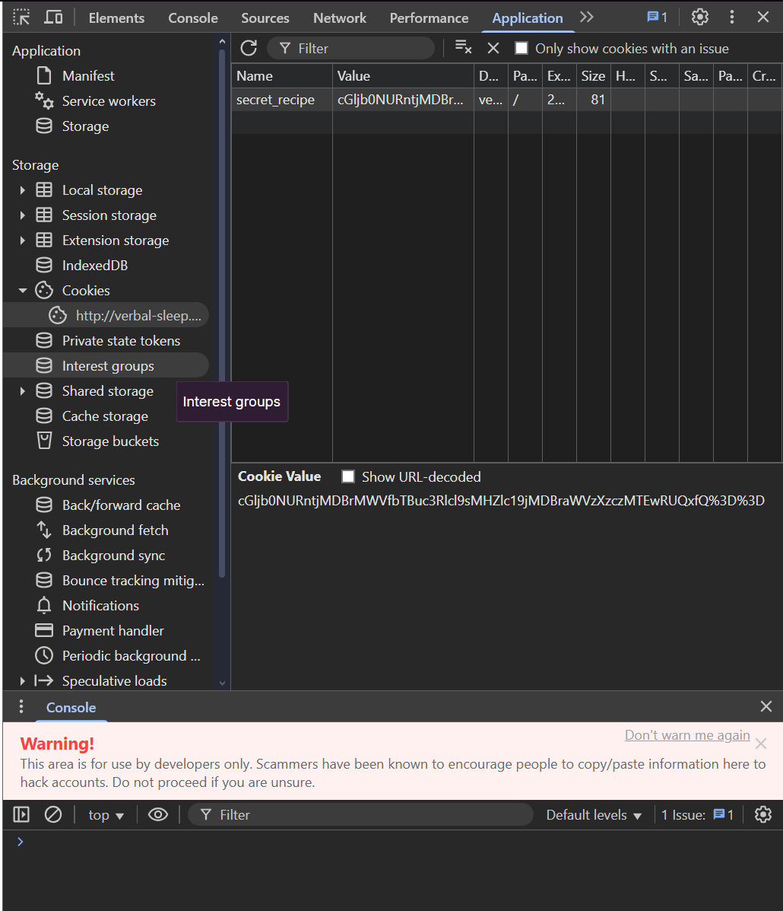

# Crack the Gate 1 (Easy)
- [Challenge information](#challenge-information)
- [Solution](#solution)
- [References](#references)

## Challenge information
```
Challenge Link: https://play.picoctf.org/practice/challenge/469?category=1&page=1
Challenge Description: Cookie Monster has hidden his top-secret cookie recipe somewhere on his website.
As an aspiring cookie detective, your mission is to uncover this delectable secret. Can you outsmart Cookie Monster and find the hidden recipe?
```

## Solution
Typing in a username and password does not take us anywhere.


Going off the hint, let's check our cookies. Using the inspect element, go to the applications tab and click cookies.




In the Elements tab, we can view the raw HTML.
In this exact tab, we see a comment: <!-- ABGR: Wnpx - grzcbenel olcnff: hfr urnqre "K-Qri-Npprff: lrf" -->
The point of comments is for developers to leave messages or for debugging purposes.
We can conclude that the comment is encrypted with ciphertext created from a ROT13 Cipher. And using a decoder we decrypted the message to get: 
<!-- NOTE: Jack - temporary bypass: use header "X-Dev-Access: yes" -->

What are headers?
When your browser communicates with a website, it sends HTTP requests to the server. Each request includes:
URL: the address you’re visiting
Data: like form inputs
Headers: which are extra pieces of information
Developers sometimes use custom headers for internal testing (which we will explain more later)


Breaking in:
The decrypted message says we should use X-Dev-Access: yes as a temporary bypass.
1. Open the Network tab in Developer Tools and try to log in (with any password).
2. You’ll see the login request appear in the list.
3. Right-click the request → “Edit and Resend” (or “Replay”) or you can click the resend button
4. Add the custom header: X-Dev-Access: yes


After adding the header, the server treats you like a “developer” and grants you access. The response now contains the flag.

## References
- [Decoder](https://www.base64decode.org/)
- [About Cookies](https://www.kaspersky.com/resource-center/definitions/cookies)
