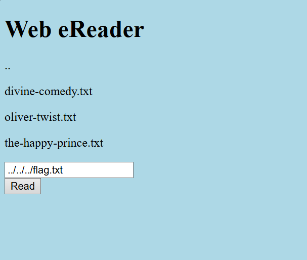
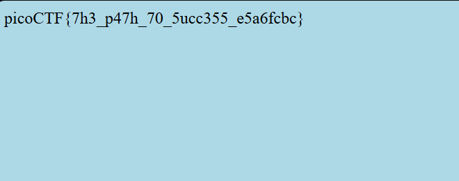

# Forbidden Paths (Medium)
- [Challenge information](#challenge-information)
- [Solution](#solution)
- [References](#references)

## Challenge information
```
Challenge Link: https://play.picoctf.org/practice/challenge/270?category=1&difficulty=2&page=2
Challenge Description: We know that the website files live in /usr/share/nginx/html/ and the flag is at /flag.txt but the website is filtering absolute file paths. Can you get past the filter to read the flag?
```
## Solution
To find the flag, we need to understand the basic but super important filesystem concept.

Absolute path
- An absolute path is the full address of a file or folder, starting from the root of the filesystem.
- It always starts at the root
- It does not depend on where you currently are

Example: macOS / Linux
```
/home/alex/Documents/notes.txt
/etc/passwd
```
Example: Windows
```
C:\Users\Alex\Documents\notes.txt
```
No matter where you are, that path points to the same file.

Relative path
- A relative path is written relative to your current directory (where your program or terminal is “standing”).
- It depends on where you are right now.

Example: If your current directory is:
```
/home/alex/projects/app/
```
And you write:
```
data/file.txt
```
It turns out to be:
```
/home/alex/projects/app/data/file.txt
```

```
.	current directory
..	parent directory (go up one level)
```

Example: if you are in
```
/home/alex/projects/app/

.. → /home/alex/projects/

../.. → /home/alex/

../../Documents/file.txt → /home/alex/Documents/file.txt
```

So to get the flag, we need to traverse the directory by adding as much ../ we need, you can keep adding that and then jsut add flag.txt at the end to get our flag.
```
../../../flag.txt works
../../../../../../../../../../../../../../../../flag.txt works as well
```
They work since we are trying to get to the root directory.




## References
- N/A
