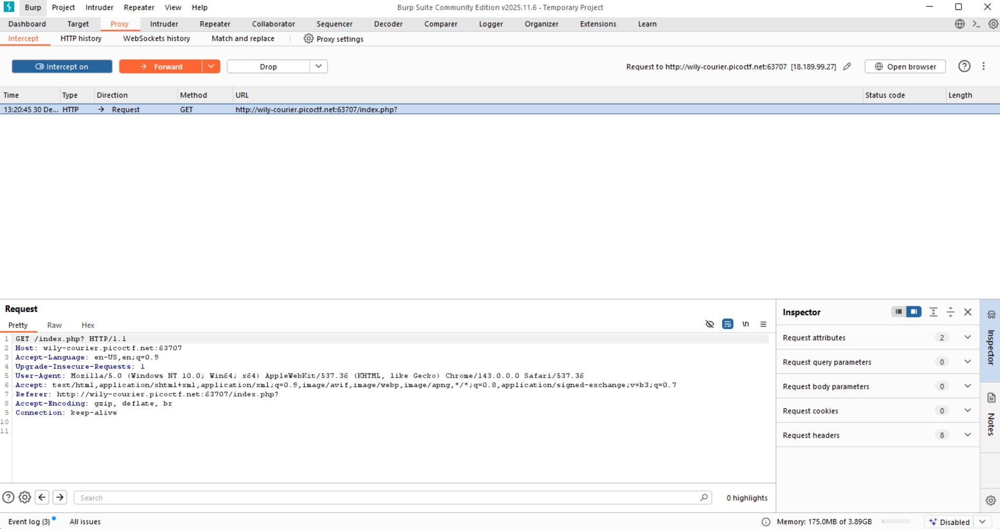
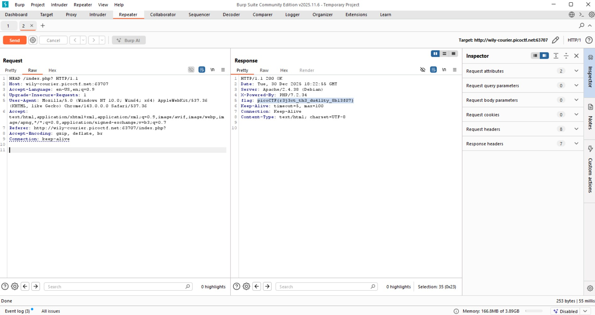

# GET aHEAD (Easy)
- [Challenge information](#challenge-information)
- [Solution](#solution)
- [References](#references)

## Challenge information
```
Challenge Link: https://play.picoctf.org/practice/challenge/132?bookmarked=0&category=1&difficulty=1&page=2&solved=0
Challenge Description: Find the flag being held on this server to get ahead of the competition
```
## Solution
To find the flag, we need to use Burp Suite, which is a  platform for web application security testing, acting as a proxy to intercept, inspect, and modify traffic between your browser and web servers, allowing ethical hackers and pentesters to manually find and exploit vulnerabilities like SQL injection or XSS, automate attacks (brute forcing), map applications, and scan for weaknesses.

Core functions include:
- Proxy Server: Sits between your browser and the internet, capturing all HTTP/HTTPS requests and responses, letting you see and change data in real-time.
- Interceptor: Pauses requests/responses so you can examine, modify, or drop them before they reach the server or browser.
- Repeater: Allows you to manually resend individual requests to test different inputs and analyze responses.
- Intruder: Automates customized attacks, such as fuzzing (sending many different inputs) or brute-forcing login forms.
- Scanner (Pro Version): Automatically finds common vulnerabilities like SQLi, XSS, and CSRF.
- Site Map & Spider: Crawls web applications to discover their structure and attack surface. 

We first intercept the communications between the site and me:


The purpose of the challenge is to modify our requests.
- GET: "Show me this page/data."
- POST: "Here's some data, do something with it (create/update)."
- HEAD: "Tell me about this resource (size, type) without showing me the content." 



## References
- [Burp Suite](https://portswigger.net/burp)
