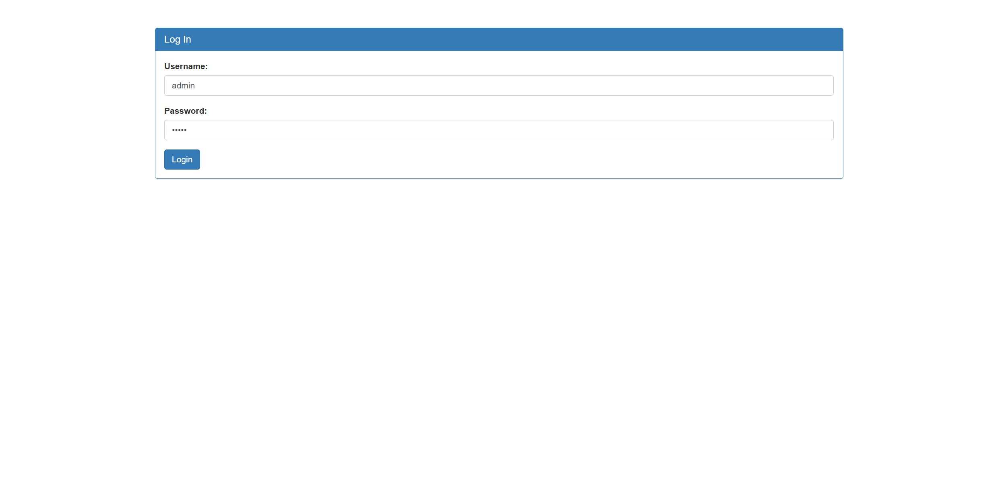
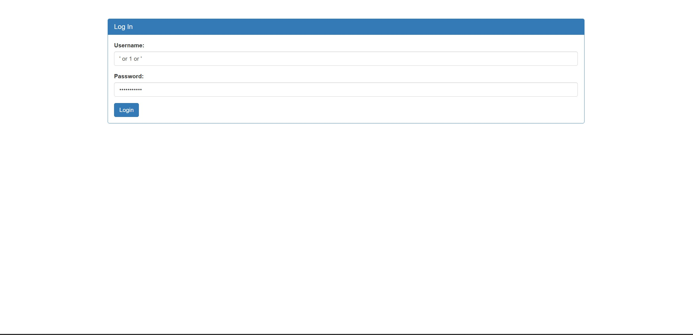
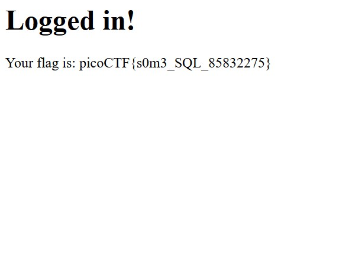

# Irish-Name-Repo 1 (Medium)
- [Challenge information](#challenge-information)
- [Solution](#solution)
- [References](#references)

## Challenge information
```
Challenge Link: https://play.picoctf.org/practice/challenge/80?category=1&difficulty=2&page=3
Challenge Description: Do you think you can log us in? Try to see if you can login!
Hints:
1. There doesn't seem to be many ways to interact with this. I wonder if the users are kept in a database?
2. Try to think about how the website verifies your login.
```

## Solution

Looking around the website with inspect element doesn't give us anything useful. So we have to make do with the login page.


Using the two hints provided, the users might be kept in a database so we can try a basic SQL Injection. SQL injection (SQLi) is a type of security vulnerability that allows an attacker to interfere with the queries your application makes to its database. This is typically done by manipulating user input that is directly included in an SQL query without proper input or data validation.

By inputting ' or 1 or ' in the username and password, we can bypass authentication and gain access.



**How does this work?**

Let's say that you have a simple login form where users input their username and password, and the application uses the following SQL query to check if the credentials are correct:
```
SELECT * FROM users WHERE username = '[user_input]' AND password = '[password_input]';
```
If an attacker inputs ' OR 1 OR ' in the username field and leaves the password field blank, the query might become:
```
SELECT * FROM users WHERE username = '' OR 1 OR '' AND password = '';
```
In this case, the OR 1 condition will always evaluate to true, meaning the query will return the first user from the database (or any user, depending on how the database is structured). This can allow the attacker to bypass authentication and gain unauthorized access.

SQLi can be prevented by using parameterized queries or input validation.
- Input validation is checking and filtering data from users or other systems to ensure it's correct, safe, and meets defined criteria (like type, format, length, range) before being processed.
- Parameterized queries uses placeholders for input values instead of embedding the values directly into the query text.

## References
- [SQLi](https://www.w3schools.com/sql/sql_injection.asp)
- [OWASP - Parameterized Queries](https://cheatsheetseries.owasp.org/cheatsheets/Query_Parameterization_Cheat_Sheet.html)
- [Database Visualized - Paramterized Queries](https://www.dbvis.com/thetable/parameterized-queries-in-sql-a-guide/)
- [OWASP - Input Validation](https://cheatsheetseries.owasp.org/cheatsheets/Input_Validation_Cheat_Sheet.html)
