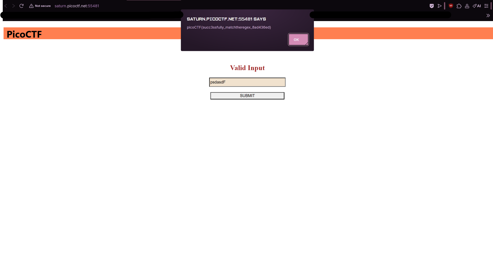
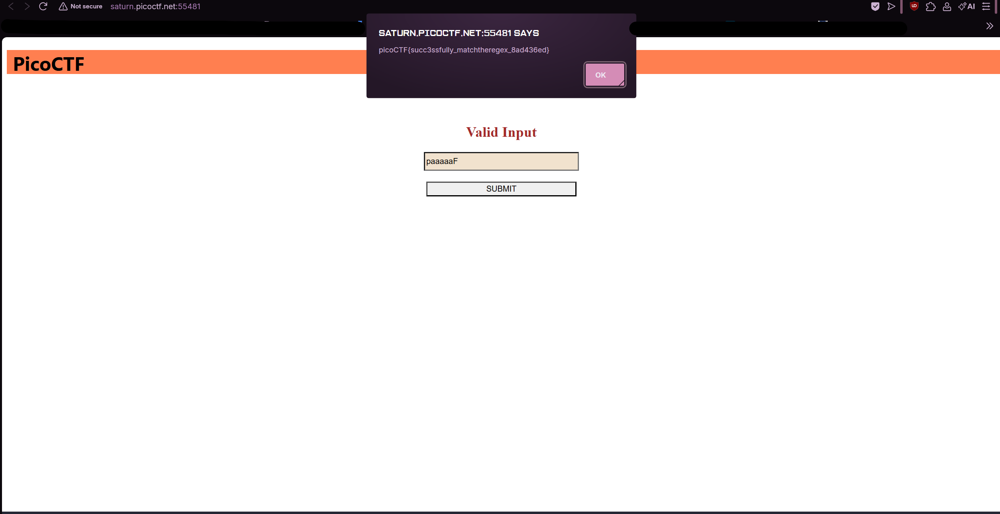

# MatchTheRegex (Medium)
- [Challenge information](#challenge-information)
- [Solution](#solution)
- [References](#references)

## Challenge information
```
Challenge Link: https://play.picoctf.org/practice/challenge/356?category=1&difficulty=2&page=1
Challenge Description: How about trying to match a regular expression
```
## Solution
Let's check the source code of the website, this particular code stands out:
```
<script>
	function send_request() {
		let val = document.getElementById("name").value;
		// ^p.....F!?
		fetch(`/flag?input=${val}`)
			.then(res => res.text())
			.then(res => {
				const res_json = JSON.parse(res);
				alert(res_json.flag)
				return false;
			})
		return false;
	}

</script>
```

The function send_request() is triggered when a certain event (like a button click) occurs. Here's the flow:
This grabs the value entered by the user in an HTML input field with the id of "name".
```
let val = document.getElementById("name").value;
```
This sends a request to the server with the user's input appended to the URL as a query parameter called input. The server is expected to respond with some data (probably in JSON format).
```
fetch(/flag?input=${val})
```
Once the server responds, this line grabs the response as text.
```
.then(res => res.text())
```
After parsing the response as JSON, it looks for a property called flag in the JSON data and displays it in an alert box.
```
then(res => { const res_json = JSON.parse(res); alert(res_json.flag) })
```

But this specific part of the code is the most important:
```
^p.....F!?
```
To break it down:
The caret symbol (^) is often used in regular expressions to denote the start of a string. So ^p means "the string must start with the character p".
```
^p:
```
The five dots (.....) represent any five characters in a row. In regular expressions, the dot (.) matches any character (except line breaks), and five dots would mean "any sequence of five characters".
```
.....:
```
This part indicates that after those five characters, there must be an F.
```
F:
```
The exclamation mark (!) and question mark (?) have specific meanings in regular expressions:
```
!?:
```
- ! doesn't have a special meaning in regular expressions on its own, but it might be used here as part of a string you need to match.
- ? means "the preceding character or group is optional." In this case, it would make the ! optional.

To sum it up, our string must:
- Start with p
- Be followed by exactly 5 characters (of any kind)
- Be followed by F
- Optionally have an exclamation mark (!)

Regex matching doesn't appear directly in this code, but the pattern ^p.....F!? is likely something that the server checks against the user input and the server might be using the regex pattern to determine if the input is valid. If the input matches the expected pattern, the server responds with a flag, which is then displayed in the alert box.

Which is why these will work:
```
pappleF
p(anythingwith5characters)F
```




## References
- N/A
