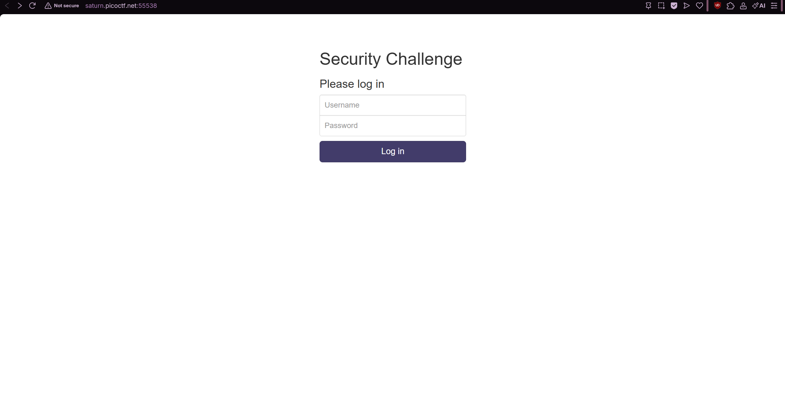
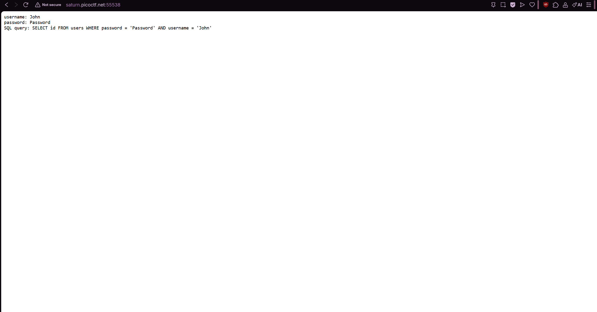
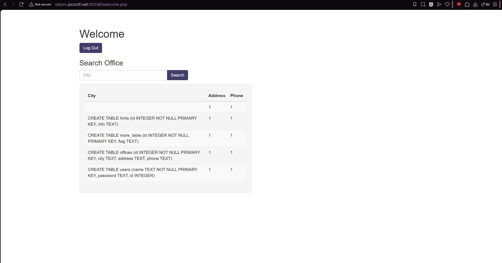
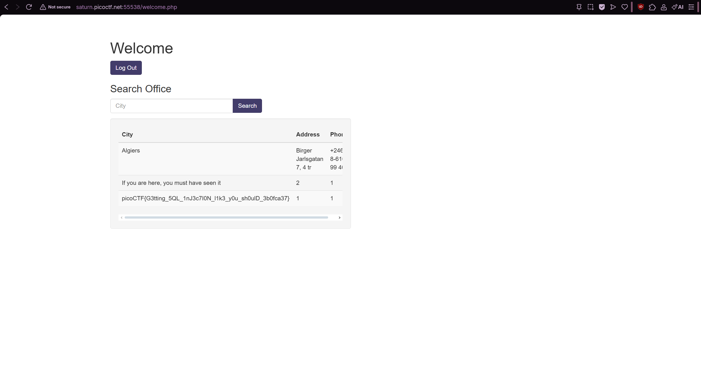

# More SQLi (Medium)
- [Challenge information](#challenge-information)
- [Solution](#solution)
- [References](#references)

## Challenge information
```
Challenge Link: https://play.picoctf.org/practice/challenge/358?category=1&difficulty=2&page=1
Challenge Description: Can you find the flag on this website.
Hints:
1. SQLiLite
```

## Solution
This is the login page, we can try typing random credentials and see what happpens:



Now we know that it's an SQL database we can try a basic SQL injection:
```
' or 1=1;--
```
The single quote is used to close any string that was opened earlier in the SQL query. SQL injection works by closing off part of the query, it allows you to manipulate the rest.
```
'
```
This is a logical condition that is always true. Normally, the SQL query might have a WHERE clause like WHERE city = 'Nairobi'. By adding or 1=1, it turns the condition into something that’s always true, like WHERE city = 'Nairobi' OR 1=1. The database will return all rows, not just the ones where the city is Nairobi.
```
or 1=1
```
This is a comment in SQL. Anything following the -- will be ignored. This is used to comment out any remaining part of the SQL query, which could otherwise interfere with the injected code.
```
--
```
In our example, since 1=1 is always true, this query would retrieve every record in the offices table, not just those related to a specific city.
```
SELECT * FROM offices WHERE city = 'Nairobi' OR 1=1;
```


After that, we see more tables with City, Address, and Phone. We can use this table to help us with another injection:
```
' Algiers' union select sql,1,1 from sqlite_master;--
```
The single quote closes the string in the SQL query, just like before.
```
'
```
Combines results from two queries. The UNION operator allows you to merge the result of a second query with the result of the original query. In this case, we are trying to get the database to give us information from two different queries: the one used by the web application and the one we are injecting.
```
union select
```
This part represents the columns we are asking for from the sqlite_master table. Since the original query might return three columns (city, address, phone), we provides values that match the number of columns. For the injected query, 1 is just a placeholder value.
```
sql, 1, 1
```
This is a special system table in SQLite that stores metadata about the database such as information about the tables, columns, and indexes. By querying it, we can see what tables exist, their structure, and other details.
```
sqlite_master
```
The query executed would look something like:
```
SELECT * FROM offices WHERE city = 'Algiers' UNION SELECT sql, 1, 1 FROM sqlite_master;
```
The sqlite_master table contains information about the schema, so the result of this query might look like:
```
CREATE TABLE offices (id INTEGER NOT NULL PRIMARY KEY, city TEXT, address TEXT, phone TEXT);
CREATE TABLE users (name TEXT NOT NULL PRIMARY KEY, password TEXT, id INTEGER);
```


After that, we do see a table called more_table that contains the flag. Therefore we must do another injection:
```
' Algiers' union select flag,id,1 from more_table;--
```
In this query, we are trying to get the flag and id from the more_table table. The 1 is a placeholder because the original query is returning three columns (city, address, and phone).
```
flag, id, 1:
```
Resulting SQL query:
```
SELECT * FROM offices WHERE city = 'Algiers' UNION SELECT flag, id, 1 FROM more_table;
```
If the more_table contains a column called flag, this query would return those flags. You might see results like:
```
flag_value_here, 1, 1
flag_value_here, 2, 1
```


## References
- [SQLite System Tables](https://www.techonthenet.com/sqlite/sys_tables/index.php)
- [SQL Injection - Invicti](https://www.invicti.com/blog/web-security/sql-injection-cheat-sheet)
- [w3schools - SQL Injection](https://www.w3schools.com/sql/sql_injection.asp)
