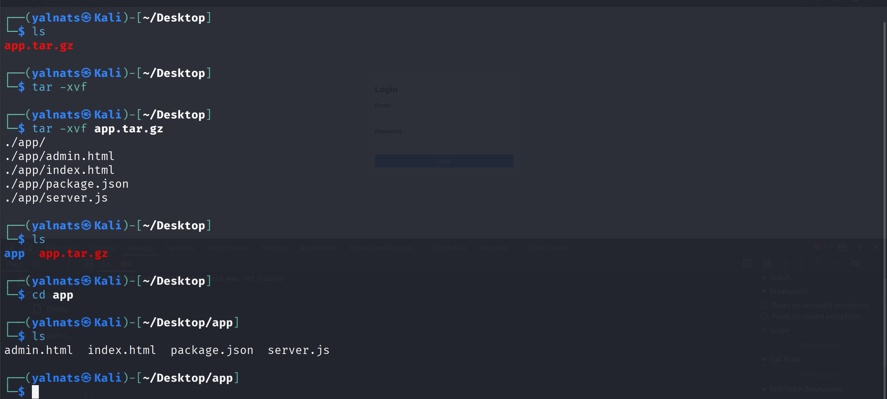
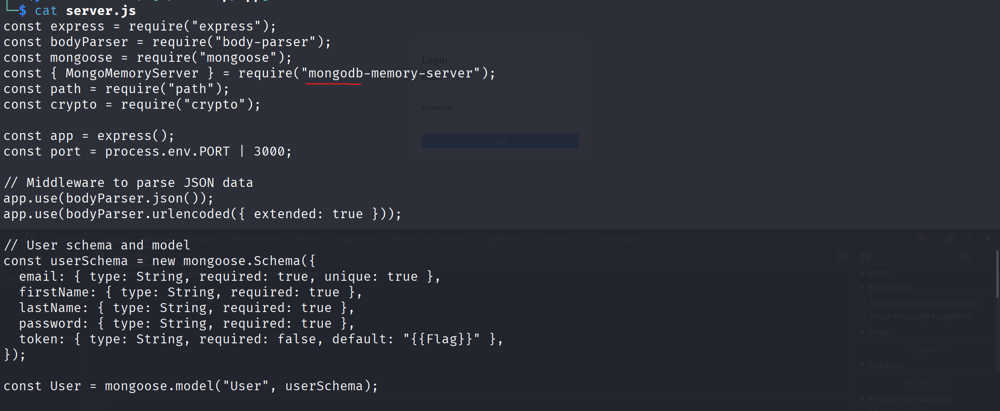
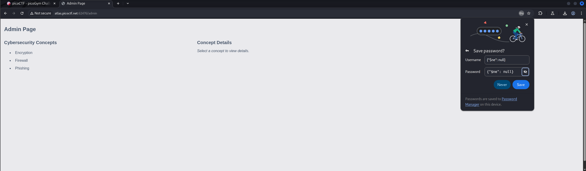
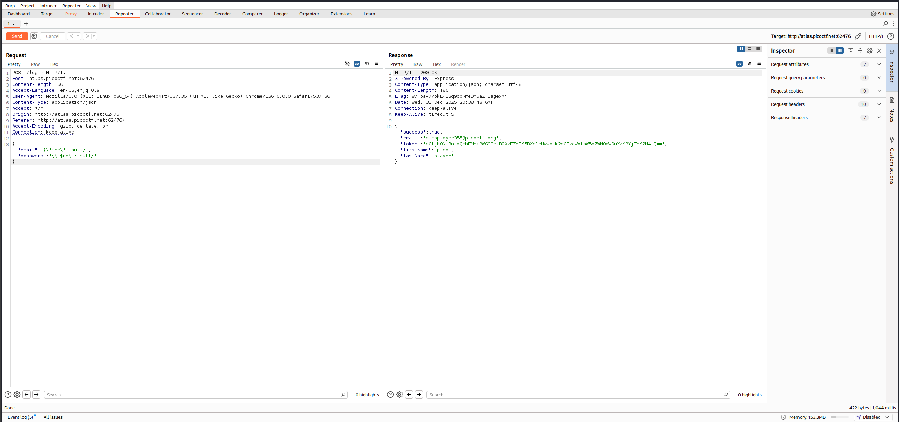

# No SQL Injection (Medium)
- [Challenge information](#challenge-information)
- [Solution](#solution)
- [References](#references)

## Challenge information
```
Challenge Link: https://play.picoctf.org/practice/challenge/443?category=1&difficulty=2&page=1
Challenge Description: Can you try to get access to this website to get the flag? You can download the source here.
```

## Solution

Looking at the website, using inspect and searching around, we won't find anything of use. So let us look into the source file that was provided.
```
ls
app.tar.gz
```
It is a tape archive (tar) that has been compressed, meaning we need to decompress it to see the contents inside, by running:
```
tar -xvf app.tar.gz
```
These files will show up:





Reading all those files, only server.js stands out, if we look closely, we can see that the server is using MongoDB. MongoDB is a popular, open source, NoSQL database that stores data in flexible, JSON-like documents rather than traditional rows and columns, making it ideal for dynamic data and modern applications needing scalability, high availability, and easy integration with application code. Now we can confirm that we have to do an nosql injection. We can use a basic authentication bypass, by typing '{"$ne": null}' in the username and password field, we trick the server into thinking that we are a valid user.
```
{"$ne": null}
```



Unfortunately, the flag is not present, using inspect element doesn't give us anything either. Let's try logging in again with our bypass credentials, but this time we use BurpSuite to intercept our request. Turning the intercept on, then logging in again will give us our request, send it to the repeater. In the repeater, we see our request with our credentials, we click send to see the response. As you can see, the token is encoded in Base64, so we must use a decoder to see what it contains.


```
cGljb0NURntqQmhEMnk3WG9OelB2XzFZeFM5RXc1cUwwdUk2cGFzcWxfaW5qZWN0aW9uXzY3YjFhM2M4fQ==
becomes
picoCTF{jBhD2y7XoNzPv_1YxS9Ew5qL0uI6pasql_injection_67b1a3c8}
```
There is our flag.


## References
- [Decoder](https://www.base64decode.org)
- [Archive/Compression formats](https://en.wikipedia.org/wiki/List_of_archive_formats)
- [Hacking Tricks - NoSQL](https://book.hacktricks.wiki/en/pentesting-web/nosql-injection.html)
- [JSON Tables](https://mariadb.com/docs/server/server-usage/storage-engines/connect/connect-table-types/connect-json-table-type)
- [JSON Tables functions](https://www.postgresql.org/docs/current/functions-json.html)
- [More JSON Tables functions](https://dev.mysql.com/doc/refman/8.4/en/json-table-functions.html)
- [IBM JSON Tables](https://developer.ibm.com/articles/i-json-table-trs/)
- [NoSQL - Gabe Fierro, Saurav Chhatrapati](https://cs186berkeley.net/resources/static/notes/n17-NoSQL.pdf)
