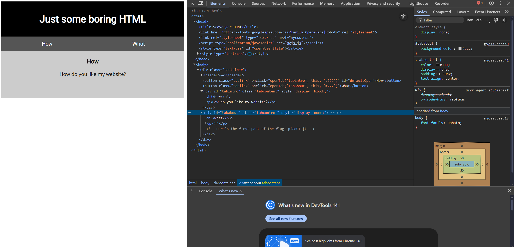
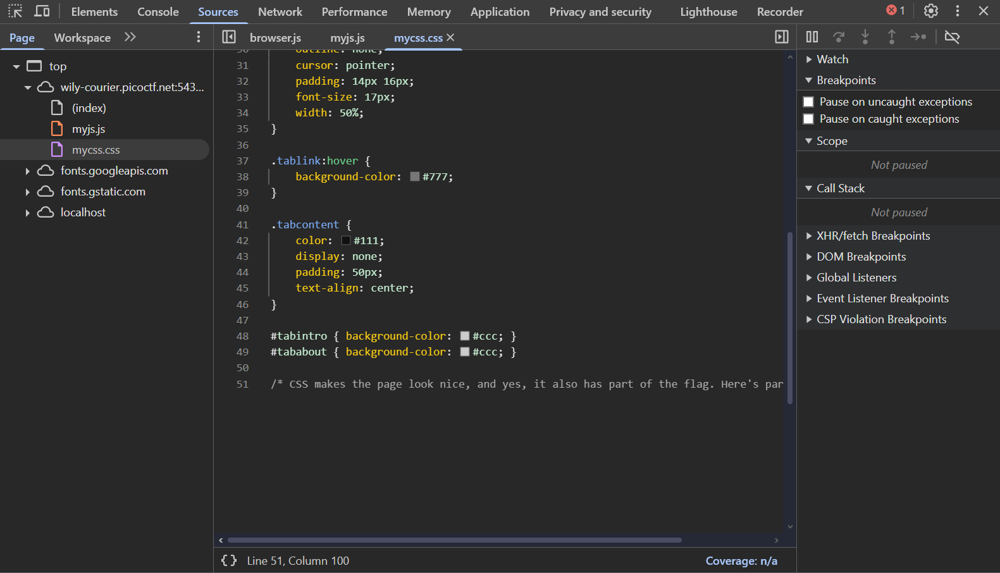
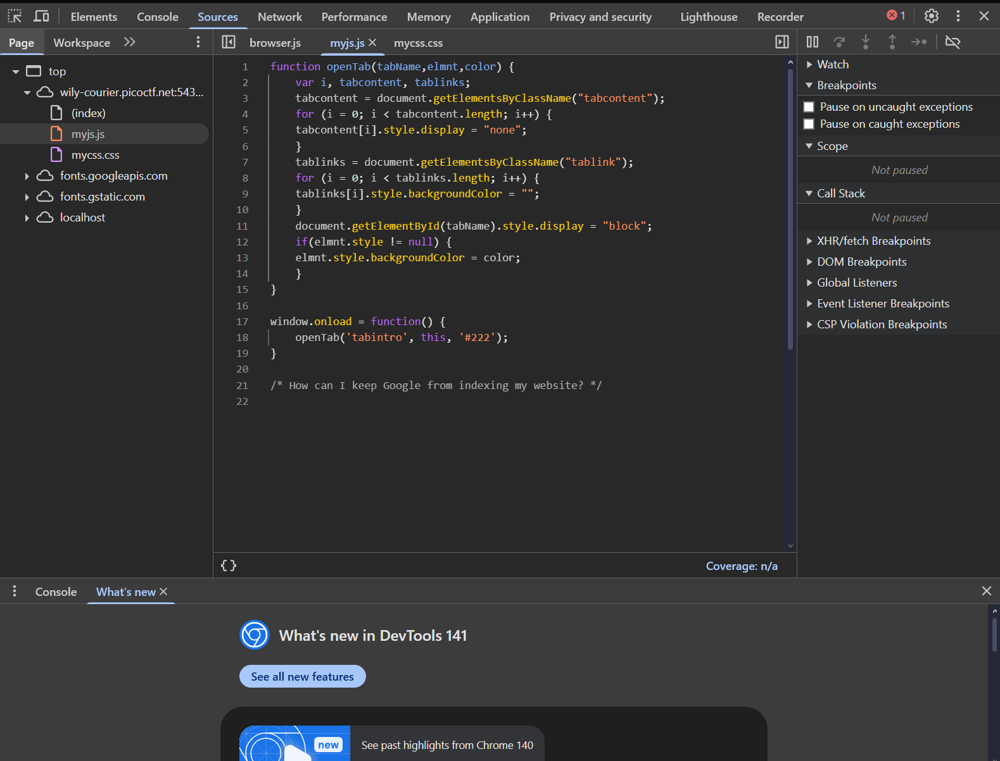
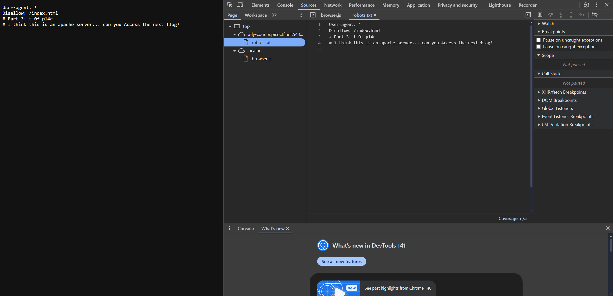
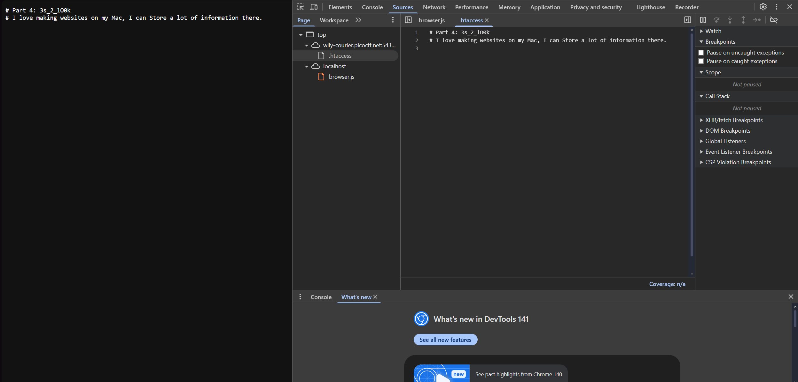
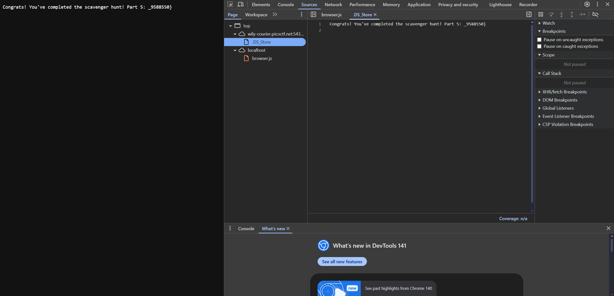

# Scavenger Hunt (Easy)
- [Challenge information](#challenge-information)
- [Solution](#solution)
- [References](#references)

## Challenge information
```
Challenge Link: https://play.picoctf.org/practice/challenge/161?category=1&difficulty=1&page=2
Challenge Description: There is some interesting information hidden around this site. Can you find it?
```
## Solution
As the title of the puzzle suggests, we are going to be looking around a lot to find our flag. First off, we use the inspect element to look at the elements and sources. Areas of interest include the elements sections, the css file, and the js file.

In the elements section, we find our first part of the flag:
```
<!-- Here's the first part of the flag: picoCTF{t -->
```


In the CSS file, we find our second part of our flag:
```
/* CSS makes the page look nice, and yes, it also has part of the flag. Here's part 2: h4ts_4_l0 */
```


In the JS file, we find a hint to our third part: "How can I keep Google from indexing my website?" --> This is referring to the robots.txt file which chooses which files that does not allow web crawlers to index. If we add:
```
/robots.txt
```
we will get our third part:
```
Part 3: t_0f_pl4c
```




In the robots.txt file, we get a hint to find our fourth part: "This is an apache server". By typing:
```
/.htaccess
```
In short, the .htaccess file is a powerful, per-directory configuration file used on Apache web servers that allows you to alter the server's settings for a specific directory and all of its subdirectories without needing to access the main server configuration files. We can find our answer there, we find our fourth part of the flag and a hint to our final part of the flag.
```
Part 4: 3s_2_lO0k
```


For our final part, we are given another hint: "I love making websites on my Mac, I can **Store** a lot of information there". This is referring to the .DS_Store file, which is an invisible macOS file created by the Finder in every folder to store custom attributes like icon positions, window size/location, and view settings (icon, list, column), essentially remembering how you like that specific folder to look and behave. It is similar to Windows' desktop.ini. By typing:
```
/DS_Store
```
We will find our final flag and we have completed the challenge.


## References
- [Apache Server - htaccess](https://httpd.apache.org/docs/current/howto/htaccess.html)
- [Where are the robots?](https://github.com/stanzhan-dev/PicoCTF-Challenges/blob/main/Web%20Exploitation/Where%20are%20the%20Robots%3F/Robots.md)
- [.DS_Store files](https://buildthis.com/ds_store-files-and-why-you-should-know-about-them/)
- [How to Disable .DS_Store files](https://www.techrepublic.com/article/how-to-disable-the-creation-of-dsstore-files-for-mac-users-folders/#:~:text=If%20you%27ve%20used%20a%20Mac%20for%20long,sort%20options%2C%20and%20icon%20size%20and%20position.)
