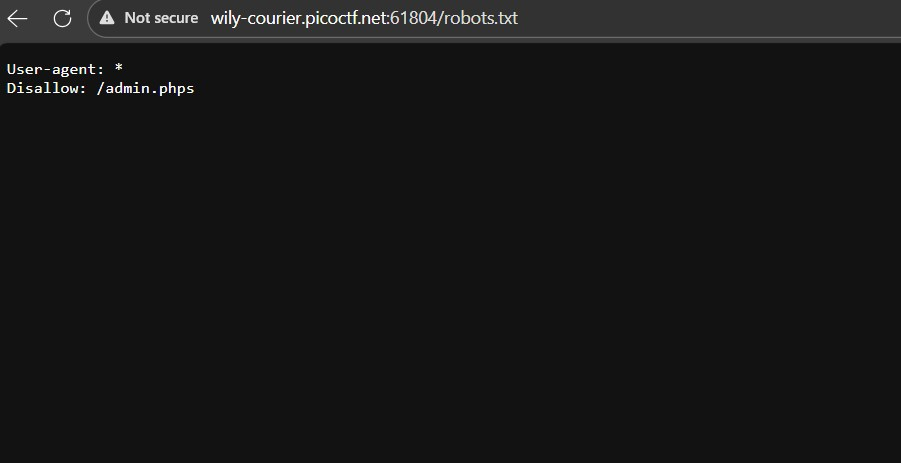
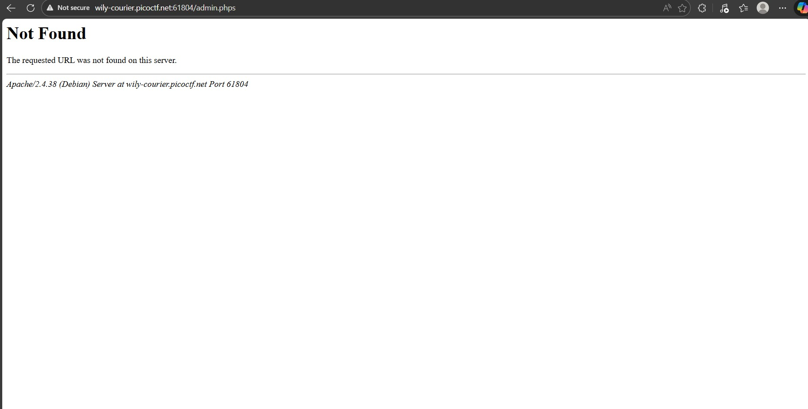
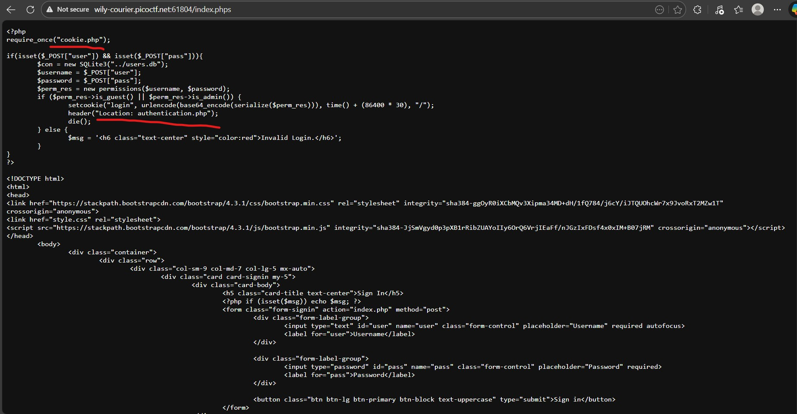
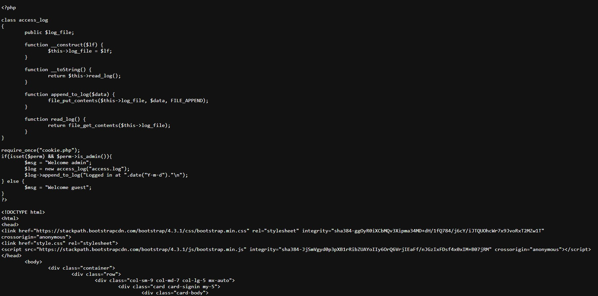
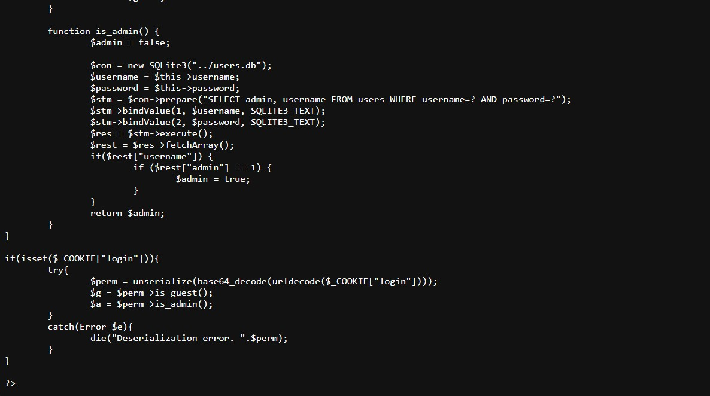
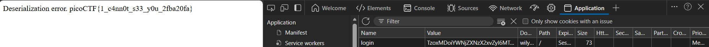

# Super Serial (Medium)
- [Challenge information](#challenge-information)
- [Solution](#solution)
- [References](#references)

## Challenge information
```
Challenge Link: https://play.picoctf.org/practice/challenge/180?bookmarked=0&category=1&difficulty=2&page=3&solved=0
Challenge Description: Try to recover the flag stored on this website
```

## Solution
Let's first check the robots.txt file, there is a hidden admin.phps file so that is where we will be checking next.


But admin.phps does not exist, however, the good thing is that now we know we can check the page source of php files. So let's check the index.phps file.


Only two notable files stand out which are the cookie.php and authentication.php, let's check their page source.


The authentication.php is the backend used to log you in and cookie.php is managing your cookies upon logging in. If you scroll down in cookie.phps, you can see that there is an unserialization process going on. Serialization is the process of converting any storable value (including objects and arrays) into a flat string representation. And unserailization convert a serialized string representation of data back into its original PHP value or data structure, such as an array or object. 



In authentication.phps, this part of the source code stands out:
```
<?php

class access_log
{
	public $log_file;

	function __construct($lf) {
		$this->log_file = $lf;
	}

	function __toString() {
		return $this->read_log();
	}

	function append_to_log($data) {
		file_put_contents($this->log_file, $data, FILE_APPEND);
	}

	function read_log() {
		return file_get_contents($this->log_file);
	}
}
```
This creates an object called access_log, which has a function called __toString() which calls a function called read_log() and read_log() gets the file contents of log_file.

So we need to create an exploit by creating a login cookie in Base64 to then put it in the system to decode it and get our flag.

PHP Serialization follows the same format:
```
O:10:"access_log":1:{s:8:"log_file";s:7:"../flag";}
```
```
O --> means “Object”
:10:"access_log" --> 10 --> the length of the class name (number of characters), "access_log" --> the class name
:1: --> This says the object has 1 property.
Everything inside {} describes the object’s fields (properties).
s:8:"log_file"; --> s --> string, 8 --> length of the string, "log_file" --> property name
s:7:"../flag"; --> s --> string, 7 --> length of the string, "../flag" --> the value assigned to log_file

We are essentially making a PHP object of class access_log with one property called log_file, whose value is "../flag".
```
Using a Base64 encoder, we turn:
```
O:10:"access_log":1:{s:8:"log_file";s:7:"../flag";}
to
TzoxMDoiYWNjZXNzX2xvZyI6MTp7czo4OiJsb2dfZmlsZSI7czo3OiIuLi9mbGFnIjt9
```
Then if we go to the authentication.php page since that is where our admin authentication happens, if we create a new cookie called 'login' and use the Base64 as our value and we refresh our page, we get our flag.



## References
- [Cyber Chef](https://gchq.github.io/CyberChef/)
